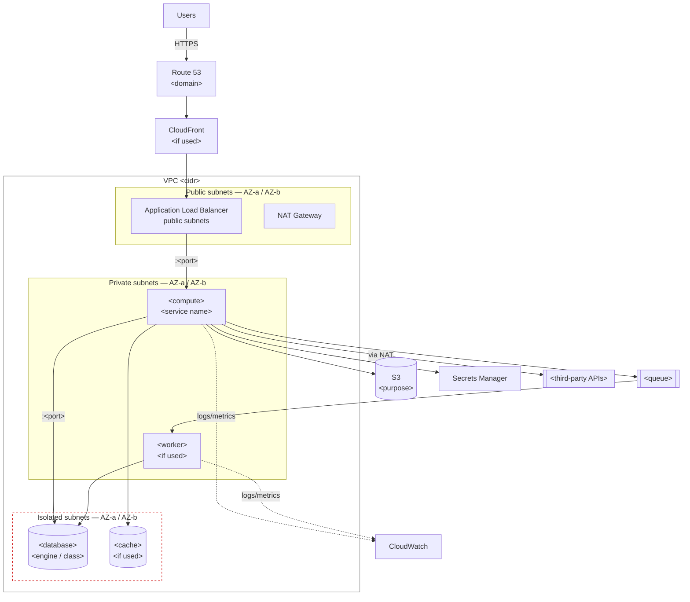

# Template — Architecture Document

Output template for `.claude/workflows/architecture-design.md`.

Fill every section. If a section does not apply, write **N/A** with the reason.
Anything not determinable is **UNKNOWN** — never a guess. Replace every `<placeholder>`.

---

# Architecture Overview

**Document version:** `<n>` · **Date:** `<date>` · **Status:** draft / under review / approved
**Author:** DevOps Architect Agent · **Approved by:** `<user>` on `<date>`

---

## Project

| Field | Value |
|---|---|
| Project name | `<name>` |
| Description | `<one-sentence description of what the software does>` |
| Repository | `<url or path>` |
| Application type | `<web app / API / worker / static site / monorepo>` |
| Primary language / framework | `<language>` / `<framework>` |
| Current deployment | `<none / local only / platform>` |
| Target environments | `<dev · staging · production>` |
| AWS region(s) | `<region>` |
| AWS account(s) | `<account or accounts per environment>` |
| Discovery report | `<link or date>` |

**Summary**

`<3–5 sentences: what the system does, who uses it, and the single constraint that most shapes
this architecture.>`

---

## Requirements

Each requirement carries an ID so later sections can reference it.

### Functional

| ID | Requirement | Priority | Source |
|---|---|---|---|
| F-1 | `<what the system must do>` | must / should / nice | `<discovery / user>` |

### Non-functional

| ID | Requirement | Target | Priority | Source |
|---|---|---|---|---|
| N-1 | `<latency / throughput / uptime / data residency>` | `<value>` | | |

### Scalability

| ID | Requirement | Today | 12 months | Source |
|---|---|---|---|---|
| S-1 | `<traffic / users / data volume>` | `<value>` | `<value>` | |

### Availability

| ID | Requirement | Value | Source |
|---|---|---|---|
| A-1 | Uptime target | `<99.x%>` | |
| A-2 | RPO — tolerable data loss | `<duration>` | |
| A-3 | RTO — required recovery time | `<duration>` | |

### Security

| ID | Requirement | Source |
|---|---|---|
| SEC-1 | `<data classification / compliance / auth model>` | |

### Budget

| ID | Constraint | Value |
|---|---|---|
| B-1 | Monthly ceiling | `<amount>` |
| B-2 | Sensitivity to fixed vs usage-based cost | `<note>` |

---

## Assumptions

> Include only where a decision was made without a confirmed requirement. Every decision resting
> on an assumption is **provisional** until the assumption is confirmed.

| # | Assumption | Why it was needed | Decisions that depend on it | What changes if wrong |
|---|---|---|---|---|
| 1 | `<assumption>` | `<unanswered question>` | `<sections / services>` | `<impact>` |

**Assumptions confirmed by the user:** `<list or "none yet">`

---

## Constraints

| Type | Constraint | Impact on design |
|---|---|---|
| Budget | `<amount / sensitivity>` | |
| Team | `<size, skill level, who operates this>` | |
| On-call | `<is anyone on call?>` | |
| Timeline | `<deadline or none>` | |
| Compliance | `<regime or none stated>` | |
| Existing infrastructure | `<what must be reused or integrated with>` | |
| Technology | `<mandated or forbidden technologies>` | |
| Lock-in tolerance | `<low / medium / high>` | |

---

## Recommended Architecture

**Headline decision**

> `<One sentence: the compute model, the data layer, and the constraint that drove them.>`

**Description**

`<4–8 sentences in prose: what runs where, how a request flows end to end, where data lives, how
asynchronous work happens. The reader should be able to picture the whole system before seeing a
single table.>`

**Why this and not the runner-up**

`<One paragraph tied to the requirement IDs above.>`

**Requirements coverage**

| Req ID | Requirement | How this design satisfies it |
|---|---|---|

---

## Architecture Diagram

**Request flow**

1. `<step>`
2. `<step>`

**Asynchronous / scheduled flow**

1. `<step>`

> Replace every `<placeholder>` and delete any component not in the design. Label the protocol
> and port on each link. Show AZ spread and subnet boundaries.

---

## AWS Services

| Service | Purpose | Why Selected | Alternatives |
|---|---|---|---|
| `<service>` | `<what it does here, one plain sentence>` | `<the requirement ID it satisfies, and why this over the alternatives>` | `<AWS alternative; non-AWS alternative>` |

### Detail per service

Repeat for each service in the table above.

#### `<Service name>`

- **What it does:** `<one plain sentence, jargon defined>`
- **Why it is needed:** satisfies `<Req ID>` — without it, `<what breaks>`
- **Why it was selected:** `<over the specific alternatives considered>`
- **Alternatives:** `<AWS alternative — why it lost>` · `<non-AWS alternative — why it lost>`
- **Trade-offs:** `<complexity / lock-in / cost / operational burden accepted>`
- **Configuration highlights:** `<sizing, tier, key settings>`
- **Cost driver:** `<what makes this bill go up>`
- **Environments:** `<dev / staging / prod — and how they differ>`

> A service that cannot be justified with all six fields is a service to remove.

---

## Networking

| Item | Design | Rationale |
|---|---|---|
| VPC CIDR | `<cidr>` | |
| Availability Zones | `<count and which>` | |
| Public subnets | `<cidrs — what lives here>` | |
| Private subnets | `<cidrs — what lives here>` | |
| Isolated / data subnets | `<cidrs>` | |
| Internet Gateway | `<yes/no>` | |
| NAT Gateway | `<count — one per AZ or shared>` | **Fixed cost: `<$/mo>`** |
| VPC endpoints | `<S3 · DynamoDB (free) · ECR · Secrets Manager · CloudWatch Logs>` | |
| Load balancer | `<ALB / NLB / API Gateway / none>` | |
| DNS | `<hosted zone, records>` | |
| TLS | `<ACM certificate, coverage, renewal>` | |

**Security group intent** *(who may talk to whom — not policy JSON)*

| From | To | Port | Protocol | Purpose |
|---|---|---|---|---|

**Every internet-reachable path**

| Path | Component | Intentional? |
|---|---|---|

---

## Security

| Layer | Design |
|---|---|
| Network placement | `<what is public, what is private, what is isolated>` |
| Encryption at rest | `<which stores, which keys — AWS-managed or CMK>` |
| Encryption in transit | `<TLS enforcement points>` |
| Key management | `<KMS keys, rotation>` |
| Secrets storage | `<Secrets Manager / Parameter Store — and why>` |
| Secret delivery | `<how the workload receives them at runtime>` |
| Secret rotation | `<automated / manual / none — and why>` |
| Authentication | `<mechanism>` |
| Authorization | `<model>` |
| WAF | `<yes/no — why>` |
| Rate limiting | `<where>` |
| Audit logging | `<CloudTrail configuration, retention>` |
| Vulnerability scanning | `<image · dependency · IaC · SAST>` |

**Top three residual risks after this design**

| # | Risk | Why accepted | Mitigation |
|---|---|---|---|
| 1 | | | |
| 2 | | | |
| 3 | | | |

---

## IAM

**Principle:** roles over users · least privilege · one role per workload · no long-lived keys.

| Principal | Type | Purpose | Permissions (intent) | Trust |
|---|---|---|---|---|
| `<role name>` | workload / CI / human | `<what it does>` | `<narrow description>` | `<who may assume it>` |

**CI/CD identity**

| Environment | Role | OIDC trust condition (`sub`) |
|---|---|---|
| staging | `<role arn>` | `repo:<owner>/<repo>:ref:refs/heads/<branch>` |
| production | `<role arn>` | `repo:<owner>/<repo>:environment:production` |

> A wildcard `sub` such as `repo:<owner>/*` lets any branch anyone can push assume the role.
> Scope to repository **and** branch or environment.

**Justified broad permissions** *(every `Action="*"` or `Resource="*"` needs a written reason)*

| Principal | Broad permission | Justification |
|---|---|---|

---

## Data Architecture

| Store | Type | Engine / class | Holds | Critical? | Encrypted | Backup |
|---|---|---|---|---|---|---|
| `<name>` | database / cache / object / queue | `<engine>` | `<what data>` | can this be lost? | | |

**Per store**

- **`<store name>`**
  - Access pattern: `<read-heavy / write-heavy / key-based / relational queries>`
  - Sizing: `<instance class, storage, expected growth>`
  - Multi-AZ: `<yes/no — cost impact>`
  - Connection limits: `<max>` vs application pool `<size>`
  - Migrations: `<tooling, how they run, backward-compatible?>`
  - Retention / lifecycle: `<policy>`

**State that constrains horizontal scaling** *(in-memory sessions, local disk writes, sticky
sessions)*

| Location | What | Constraint it creates | Resolution |
|---|---|---|---|

---

## Application Architecture

| Component | Type | Runtime | Port | Stateless? | Scaling | Starts with |
|---|---|---|---|---|---|---|
| `<name>` | web / API / worker / job / static | `<runtime>` | `<port>` | yes / no | `<mechanism>` | `<command>` |

**Per component**

- **`<component>`**
  - Responsibility: `<what it does>`
  - Boot dependencies: `<what must exist before it starts>`
  - Health endpoint: `<path — what it actually verifies>`
  - Graceful shutdown: `<SIGTERM handling, drain time>`
  - Configuration: `<how it receives config>`

**External integrations**

| Service | Purpose | Direction | Critical path? | Credentials | Failure impact |
|---|---|---|---|---|---|

---

## Scalability

| Component | Scales | Trigger / signal | Min | Max | Notes |
|---|---|---|---|---|---|
| `<name>` | automatically / manually | `<metric>` | | | |

- **Order in which components hit their limits:** `<1st, 2nd, 3rd>`
- **First bottleneck, by name:** `<component and reason>`
- **Current architectural ceiling:** `<traffic / data volume>`
- **Revisit this design at:** `<threshold>`
- **What changes at 10x:** `<the growth path>`

---

## High Availability

| Item | Design | Meets requirement? |
|---|---|---|
| Uptime target | `<A-1>` | |
| AZ spread | `<how many, which components>` | |
| Redundancy per component | `<replica counts>` | |
| Load balancer health checks | `<what they verify>` | |
| Graceful degradation | `<what still works when X fails>` | |
| Deploy-induced downtime | `<none / expected>` | |

**Single points of failure**

| SPOF | Impact if it fails | Accepted deliberately? | Recovery path |
|---|---|---|---|

**Failure mode analysis**

| Failure | Blast radius | Detection | Automatic recovery? | Manual action |
|---|---|---|---|---|
| Single instance / task | | | | |
| Availability zone | | | | |
| Database | | | | |
| Dependency / third party | | | | |
| Region | | | | |

---

## Disaster Recovery

| Item | Value |
|---|---|
| RPO target (`A-2`) | `<duration>` |
| RPO achieved by this design | `<duration>` |
| RTO target (`A-3`) | `<duration>` |
| RTO achieved by this design | `<duration — measured or estimated?>` |
| Backup frequency | `<per store>` |
| Backup retention | `<duration>` |
| Backup encryption | `<yes/no>` |
| Backups survive primary account compromise | `<yes/no — how>` |
| **Restore tested** | ⬜ not yet · ✅ `<date>` |

**Recovery procedures**

| Scenario | Procedure | Est. time | Executable by |
|---|---|---|---|
| Accidental data deletion | | | |
| Database corruption | | | |
| AZ loss | | | |
| Region loss | | | |
| Account compromise | | | |

---

## Monitoring

**Observability tier:** small / growing / larger — **because** `<reason>`

| Signal | Component | Source | Threshold |
|---|---|---|---|
| Latency p95/p99 | | | |
| Error rate | | | |
| Traffic | | | |
| Saturation | | | |

**Logging**

| Log type | Destination | Format | Retention |
|---|---|---|---|

**Alerts**

| Alert | Condition | Tier (page/ticket) | Routed to | Runbook |
|---|---|---|---|---|

**Dashboards:** `<which, for whom, answering what>`
**Is anyone on call?** `<yes/no — and what that implies for the uptime target>`

---

## CI/CD

| Stage | Tooling | Blocking |
|---|---|---|
| Lint / test | | |
| Security scans | | |
| Build | | |
| Image scan | | |
| Registry push | | |
| Staging deploy | | |
| Validation / smoke tests | | |
| **Production approval** | GitHub Environment + required reviewers | ✅ |
| Production deploy | | |

| Item | Value |
|---|---|
| Platform | `<GitHub Actions / other>` |
| Artifact strategy | build once, promote same artifact |
| Tagging | `<git SHA — immutable>` |
| Registry | `<ECR repository>` |
| AWS authentication | OIDC — `<role per environment>` |
| Deployment strategy | `<rolling / blue-green / canary>` |
| **Rollback mechanism** | `<per target>` |
| Rollback trigger | `<condition>` |
| Migrations backward-compatible | `<yes/no>` |

---

## Cost Considerations

### Fixed monthly floor — bills at zero traffic

| Resource | `<$/mo>` | Notes |
|---|---|---|
| `<resource>` | | |
| **Total fixed** | **`<$/mo>`** | |

### Usage-based

| Driver | Assumption | `<$/mo>` |
|---|---|---|

### Estimated total

**`<$X>` – `<$Y>` / month** at `<stated scale>`, in `<region>`, at list pricing.
*Figures require confirmation against the AWS pricing page.*

**Top three cost drivers:** 1. `<>` 2. `<>` 3. `<>`

### Three tiers

| Tier | `<$/mo>` | What you get | What you give up |
|---|---|---|---|
| Low-cost | | | |
| **Recommended** | | | |
| Production-scale | | | |

### Growth and controls

- **Cost at 10x traffic:** `<estimate>`
- **Free-tier items and expiry:** `<list>`
- **Cost controls:** budget alarm `<threshold>` · anomaly detection · cost allocation tags ·
  lifecycle policies · non-production shutdown schedule

---

## Alternatives Considered

### Compute — four-way comparison *(always complete this table)*

| | Lambda | ECS Fargate | EC2 | EKS |
|---|---|---|---|---|
| Fits this project? | | | | |
| Cost floor | | | | |
| Scaling | | | | |
| Ops overhead | | | | |
| Key limitation here | | | | |
| **Verdict** | | | | |

**Chosen:** `<option>` · **Runner-up:** `<option>` · **What would flip it:** `<condition>`

### Other significant decisions

Repeat per decision.

#### `<Decision — e.g. data store>`

| Lens | `<Option A>` | `<Option B>` | `<Option C>` |
|---|---|---|---|
| Cost | | | |
| Security | | | |
| Scalability | | | |
| Reliability | | | |
| Complexity | | | |
| Operational overhead | | | |
| Maintainability | | | |

**Chosen:** `<option>` — **decided by:** `<the one sentence>`
**Non-AWS alternative considered:** `<option>` — **why it lost:** `<reason>`

### What would be designed differently at 10x scale

`<the growth path, and the threshold that triggers each change>`

---

## Trade-offs

| # | Trade-off accepted | Why acceptable now | What would force a revisit |
|---|---|---|---|
| 1 | | | |

Cover: single points of failure accepted · cost ceilings · manual steps left manual · lock-in
taken on · capabilities deferred · performance traded for simplicity.

**Lock-in taken on**

| Choice | How hard to reverse | Cost of reversing |
|---|---|---|

---

## Risks

| # | Risk | Likelihood | Impact | Mitigation | Owner |
|---|---|---|---|---|---|
| 1 | | low/med/high | low/med/high | | |

---

## Open Questions

**Blocking** — design cannot be finalized until answered.

| # | Question | What it changes | Asked | Answered |
|---|---|---|---|---|
| 1 | `<question>` | `<if X then A, if Y then B>` | `<date>` | |

**Non-blocking** — worth resolving, does not block.

| # | Question | Why it matters |
|---|---|---|

**Marked UNKNOWN in this document:** `<list every UNKNOWN, so none is forgotten>`

---

## Implementation Phases

| Phase | What gets built | Depends on | Verifiable when | Effort | Approval required |
|---|---|---|---|---|---|
| 1 | `<foundation>` | — | `<test>` | `<estimate>` | |
| 2 | | Phase 1 | | | |
| 3 | | | | | **[NEEDS EXPLICIT APPROVAL]** |

**Rules:** Phase 1 must produce something running and verifiable — not a stack of prerequisites.
Mark every phase touching production or performing destructive operations. Note which phases can
be deferred without blocking the rest.

**Deferred to a later phase:** `<what, and why it is safe to defer>`

---

## Validation

How each phase is proven to work. **A command succeeding is not evidence the thing works.**

| Phase | What to verify | Method | Expected result |
|---|---|---|---|
| 1 | `<>` | `<command or check>` | `<>` |

**Pre-production validation gates**

| Gate | Requirement |
|---|---|
| Build | Artifact builds reproducibly; tests green in CI |
| Image | No secrets (`docker history`), non-root, healthcheck passes |
| Infrastructure | `plan` reviewed; no unexpected destroys or replacements |
| Networking | Endpoints reachable as intended; **nothing reachable that should not be** |
| Health checks | Green at load balancer **and** orchestrator |
| Staging | Exercised with the **same artifact** that will reach production |
| Monitoring | Metrics flowing; alarms in OK, not `INSUFFICIENT_DATA` |
| Restore | **A backup restore actually tested** — date: `<____>` |

**What cannot be validated before production:** `<state it honestly>`

---

## Rollback

Defined **before** the first deploy, not during the first incident.

| Field | Value |
|---|---|
| Mechanism | `<per compute target>` |
| Roll back to | `<previous artifact SHA / task definition revision / Lambda version>` |
| Estimated time | `<minutes>` |
| Executed by | `<who>` |
| **Practised in staging** | ⬜ not practised · ✅ `<date>` |
| Automatic or manual | `<>` |

**Rollback triggers** — act without further debate if any occur:

| Trigger | Threshold |
|---|---|
| Smoke test failure | any |
| Error rate | `> <X>%` for `<duration>` |
| Latency p95 | `> <X>ms` for `<duration>` |
| Health checks failing | `<n>` consecutive |
| Data integrity concern | any |

**Database rollback:** `<schema rollback path, or "migrations are backward-compatible; no schema
rollback needed">`

**What rollback does NOT restore:** `<data written by the new version, migrated schema, external
side effects — state explicitly>`

> ⚠ **Rollback does not undo database migrations.** Migrations must be backward-compatible with
> the previous application version — expand, migrate, then contract in a later release.

**No tested rollback path = production is BLOCKED.**

---

## Approval

| Item | Status |
|---|---|
| Architecture reviewed by user | ⬜ |
| Assumptions confirmed | ⬜ |
| Blocking questions answered | ⬜ |
| Cost accepted | ⬜ |
| **Architecture approved** | ⬜ `<date>` |

**Next step:** `<the single next action, and what it needs from the user>`

> This is a design document. **Nothing has been deployed.** Implementation begins only on
> explicit approval, and proceeds via `.claude/workflows/deployment.md`.
