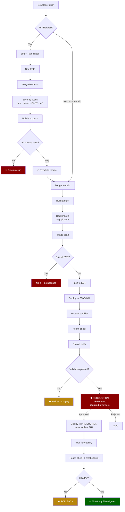
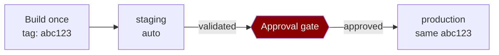

# Template — CI/CD Pipeline Architecture

Output template for `.claude/workflows/ci-cd.md`.

Fill every section. If a section does not apply, write **N/A** with the reason. Anything not
determinable is **UNKNOWN** — never a guess.

---

# CI/CD Pipeline — <Project Name>

**Platform:** GitHub Actions · **Deployment target:** <ECS / EKS / Lambda / EC2 / S3+CloudFront>
**AWS region:** <region> · **Account(s):** <staging / production>
**Date:** <date> · **Based on architecture approved:** <date>

---

## Source

| Item | Value |
|---|---|
| Repository | |
| Visibility | public / private |
| Default branch | |
| Branching model | trunk-based / GitFlow / other |
| Branch protection | required checks · required reviews · no direct push to main |
| Monorepo? | yes / no — if yes, path filters used |

**Workflow files:**

| File | Purpose |
|---|---|
| `.github/workflows/ci.yml` | PR validation |
| `.github/workflows/deploy.yml` | Build once, promote through environments |
| `.github/workflows/security.yml` | Scheduled scans |

---

## Trigger

| Workflow | Trigger | Runs |
|---|---|---|
| CI | `pull_request` → main | lint, test, scan, build (no push) |
| Deploy | `push` → main | full pipeline through staging, gated at production |
| Deploy | `workflow_dispatch` | manual run, environment as input |
| Security | `schedule` (weekly) | full dependency + SAST sweep |

**Standing settings on every workflow:**

```yaml
permissions:          # explicit and minimal — GitHub defaults are broader than needed
  contents: read
concurrency:          # cancel superseded PR builds; NEVER cancel production deploys
  group: ${{ github.workflow }}-${{ github.ref }}
  cancel-in-progress: true
```

- `timeout-minutes` on every job: **<value>**
- Third-party actions pinned by **commit SHA**: ✅ / ❌

---

## Pull Request Checks

Everything here runs on every PR and must pass before merge.

| Check | Blocking | Typical duration |
|---|---|---|
| Lint / format | ✅ | |
| Type check | | |
| Unit tests | ✅ | |
| Integration tests | | |
| Dependency scan | | |
| Secret scan | ✅ | |
| SAST | | |
| IaC scan | | |
| Build (no push) | ✅ | |

**Ordering:** cheapest first — lint before unit tests before integration tests before build.
Feedback on a formatting error should arrive in under a minute.

> ⚠ Trigger is `pull_request`, **not** `pull_request_target`. Combining `pull_request_target`
> with checkout of PR code is a direct secret-exfiltration path. Forked PRs receive no secrets
> by design — do not work around this.

---

## Testing

| Layer | Framework | Command | Dependencies | Runs on |
|---|---|---|---|---|
| Unit | | | none | PR + main |
| Integration | | | <service containers> | PR + main |
| Smoke | | | deployed environment | after each deploy |

- **Install command:** `npm ci` / `pip install -r requirements.txt` — lockfile-respecting
- **Dependency cache key:** hash of `<lockfile>`
- **Service containers:** <postgres:16, redis:7…> — **readiness wait before tests run:** ✅ / ❌
- **Known flaky tests:** none / <list and plan>

> A missing readiness wait is the most common source of flaky integration jobs. Tests that
> cannot fail the build are theatre.

---

## Security Scanning

| Scan | Tool | Policy | Runs at |
|---|---|---|---|
| Dependency | Dependabot / Trivy | block on: <severity> | PR + weekly |
| Secret | GitHub secret scanning + push protection | **block** | PR + push |
| SAST | CodeQL / Semgrep | report / block | PR + weekly |
| IaC | tfsec / Checkov / `trivy config` | block on: <severity> | PR |
| Image | Trivy / Grype + ECR scan-on-push | **block on CRITICAL** | before registry push |

**Block-or-report policy stated explicitly:** ✅ — *(blocking on every transitive CVE stops all
work; blocking on critical severity in production paths is reasonable — decide, don't default)*

**Repository settings enabled:** Dependabot ⬜ · secret scanning ⬜ · push protection ⬜

---

## Build

**Build once. This artifact is what reaches production. Never rebuild per environment.**

| Item | Value |
|---|---|
| Build command | |
| Artifact produced | |
| Target architecture | `linux/amd64` / `linux/arm64` |
| Build cache | `type=gha` (Buildx) |
| Reproducible (lockfile + pinned base) | ✅ / ❌ |

---

## Docker Image

| Item | Value / Status |
|---|---|
| Base image (pinned) | |
| Multi-stage build | ✅ / ❌ |
| Non-root user | ✅ / ❌ |
| `.dockerignore` excludes `.git`, `node_modules`, `.env` | ✅ / ❌ |
| No secrets in any layer (`docker history` verified) | ✅ / ❌ |
| Healthcheck defined | ✅ / ❌ |
| Exec-form `CMD` (graceful SIGTERM) | ✅ / ❌ |
| Final image size | |

> Secrets must never be build args — `ARG` and `ENV` are visible in `docker history`.
> Use BuildKit `--mount=type=secret` if a build genuinely needs one.

---

## Image Tagging

| Tag | Mutability | Purpose |
|---|---|---|
| `<sha>` | **immutable** | The identity. What gets deployed and rolled back to |
| `staging` | moving pointer | Convenience only — points at a SHA tag, never replaces it |
| `production` | moving pointer | Convenience only |

**Never `:latest`.** It makes deploys and rollbacks non-deterministic.

**Currently deployed:** staging `<sha>` · production `<sha>`

---

## Registry

| Item | Value |
|---|---|
| Registry | AWS ECR — `<account>.dkr.ecr.<region>.amazonaws.com/<repo>` |
| Authentication | OIDC → `aws-actions/amazon-ecr-login` |
| Scan on push | ✅ / ❌ |
| Tag immutability | ✅ / ❌ |
| **Lifecycle policy** | keep last <N> tagged · expire untagged after <N> days |
| VPC endpoint required for private-subnet pulls | ✅ / ❌ / N-A |

> Without a lifecycle policy every CI build's image stays forever. 20 images/day at 500 MB
> accumulates ~3 TB a year.

---

## Staging Deployment

| Item | Value |
|---|---|
| Trigger | automatic on merge to main |
| Environment | `staging` |
| Deployed artifact | the SHA just built — **no rebuild** |
| Migrations | run exactly as production will run them |
| Deploy mechanism | <per target — see below> |
| **Stability wait** | ✅ required |
| IAM role | `<staging-deploy-role>` — cannot touch production |

**Deploy mechanism by target:**

| Target | Mechanism | Stability gate |
|---|---|---|
| ECS | render task def → register → update service | `--wait services-stable` |
| EKS | `update-kubeconfig` → apply / `helm upgrade` | `kubectl rollout status` |
| Lambda | publish version → shift alias | alias points at new version |
| EC2 | CodeDeploy / ASG instance refresh | health check + batch size |
| S3+CF | `s3 sync` → invalidation | invalidation completed |

---

## Validation

The pipeline verifies the deploy — it does not merely perform it.

| Check | Verifies | Fails pipeline |
|---|---|---|
| Stability wait | New version actually running, not crash-looping | ✅ |
| Health check | Load balancer targets healthy | ✅ |
| Smoke tests | Real request path works — auth, database, core endpoint | ✅ |
| Error rate | No spike in the minutes after deploy | ✅ |
| Startup logs | Booted clean, no startup errors | |

**Smoke test commands:**

```bash
# e.g. curl -fsS https://staging.example.com/health
```

> **A green pipeline over a failed deploy is its own bug.** If validation fails, the pipeline
> fails loudly and rolls back where configured.

---

## Production Approval

**The gate. The pipeline must be structurally incapable of reaching production without it.**

| Control | Setting |
|---|---|
| GitHub Environment | `production` |
| **Required reviewers** | `<user/team>` |
| Deployment branch rule | `main` only |
| Wait timer | <none / N minutes> |
| Environment secrets | production values invisible to all other jobs |

**The approval request must carry:** what changed · artifact SHA · staging validation result ·
migration plan and reversibility · rollback path and duration.

> A reviewer approving blind is a gate in name only.

**Approval:** ⬜ not requested · ⬜ requested <date> · ⬜ **GRANTED <date> by <user>**

---

## Production Deployment

| Item | Value |
|---|---|
| Trigger | after approval only |
| Deployed artifact | **same SHA validated in staging** — no rebuild |
| Strategy | rolling / blue-green / canary |
| Supporting machinery | <CodeDeploy / ALB weighted TGs / Lambda alias weights / Argo Rollouts> |
| Stability wait | ✅ |
| Smoke tests | ✅ |
| Observation window | <duration> |
| IAM role | `<production-deploy-role>` — assumable only from `production` environment |

> Blue/green and canary are not free — they need the machinery named above. Rolling is the
> right default for a stateless app with correct health checks.

---

## Health Checks

| Layer | Endpoint / mechanism | Interval | Threshold | Verifies |
|---|---|---|---|---|
| Container | `HEALTHCHECK` | | | process serving |
| Orchestrator | readiness / liveness probe | | | ready for traffic / not wedged |
| Load balancer | target group health check | | | reachable and healthy |
| Post-deploy | smoke test | once | | end-to-end path works |

> The health endpoint must verify the app can **serve**, not merely that the process is alive.
> Liveness must not check downstream dependencies — a database blip should not restart the fleet.

---

## Rollback

**Decided before the first deploy, not during the first incident.**

| Item | Value |
|---|---|
| Mechanism | <per target — see below> |
| Trigger | failed smoke test / error rate > <X>% / failed health check |
| Automatic or manual | |
| Time to roll back | |
| **Practiced in staging** | ⬜ **NOT PRACTICED** / ✅ <date> |
| Previous artifact retained | ✅ / ❌ |

| Target | Rollback command |
|---|---|
| ECS | update service → previous task definition revision |
| EKS | `kubectl rollout undo deployment/<name>` |
| Lambda | point alias at previous version |
| S3 | redeploy previous artifact (versioning on) |

> ⚠ **Rollback does not undo database migrations.** Migrations must be backward-compatible with
> the previous version — expand, migrate, then contract in a later release.
>
> **Migrations in this pipeline are backward-compatible:** ✅ / ❌ / N-A

---

## Secrets

| Secret | Scope | Store | Used by |
|---|---|---|---|
| | repository / environment | GitHub secret | |
| | runtime | AWS Secrets Manager | application |

**Rules applied:**
- ⬜ No AWS access keys anywhere — OIDC only
- ⬜ Application secrets read from Secrets Manager **at runtime**; GitHub holds only the deploy identity
- ⬜ Environment secrets scoped so no dev job can read production values
- ⬜ No secrets echoed to logs or passed on command lines
- ⬜ No secrets as Docker build args

**Any secret found committed:** none / **<file — COMPROMISED, ROTATION REQUIRED>**

---

## IAM / OIDC

```yaml
permissions:
  id-token: write      # required to request the OIDC token
  contents: read

- uses: aws-actions/configure-aws-credentials@v4
  with:
    role-to-assume: arn:aws:iam::<account>:role/<role>
    aws-region: <region>
```

| Environment | Role ARN | Trust condition (`sub`) | Permissions |
|---|---|---|---|
| staging | | `repo:<owner>/<repo>:ref:refs/heads/main` | ECR push, ECS update (staging) |
| production | | `repo:<owner>/<repo>:environment:production` | ECR pull, ECS update (prod) |

> **The trust policy is the security boundary.** A wildcard such as `repo:owner/*` means any
> branch anyone can push may assume the role — the most common OIDC misconfiguration, and a
> HIGH security finding. Scope to repo **and** branch or environment.

**Provisioning:** OIDC provider and roles created by `terraform` — not by this pipeline.

---

## Notifications

| Event | Channel | Recipients |
|---|---|---|
| PR checks failed | GitHub PR status | author |
| Main branch build failed | <Slack / email> | |
| Staging deploy completed | | |
| **Production approval requested** | | approvers |
| Production deploy succeeded | | |
| **Production deploy failed / rolled back** | | |
| Security scan found CRITICAL | | |

> Notify on what someone will act on. A channel that fires on every green build gets muted, and
> then the failure notification gets muted with it.

---

## Pipeline Diagram



### Environment promotion



> **Build once, promote the same artifact.** Rebuilding per environment means production runs
> something that was never tested.

---

## Review Checklist

| Item | ✅ |
|---|---|
| No static AWS credentials anywhere | |
| OIDC trust scoped to repo **and** branch/environment | |
| Explicit minimal `permissions:` on every workflow | |
| Third-party actions pinned by SHA | |
| No `pull_request_target` with untrusted checkout | |
| Build once, promote same artifact | |
| Immutable SHA tags, no `:latest` | |
| All five scans present, block-or-report decided | |
| Image scanned **before** registry push | |
| Deploy waits for stability | |
| Smoke tests after every deploy | |
| Production gated by required reviewers | |
| Rollback defined **and practiced** | |
| Migrations backward-compatible | |
| `timeout-minutes` on every job | |
| ECR lifecycle policy set | |
| No secrets in logs or on command lines | |

**Verified by:** <who> · **Date:** <date>
